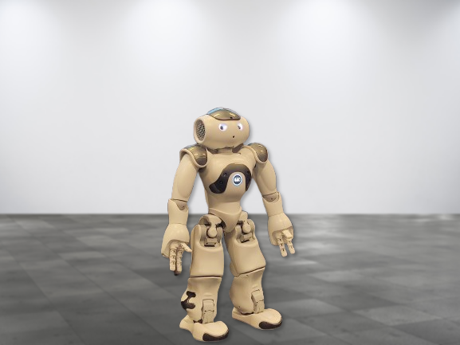

# A Yoga Instructor Robot for Stress Relief

This repository contains the code that was used to implement the Flask server for pose estimation and the behavior of NAO in Choreographe for the Human-Robot Interaction project.

Use the instructions on `Flask_server` and  `Yoga_Nao_Choregraphe` folders to run the code.

<small>Made by Loek Gerrits, Fotini Papadopoulou, Nicolo Sansevrino, Jet Verbeek</small>

<small>Radboud University, Nijmegen</small>

